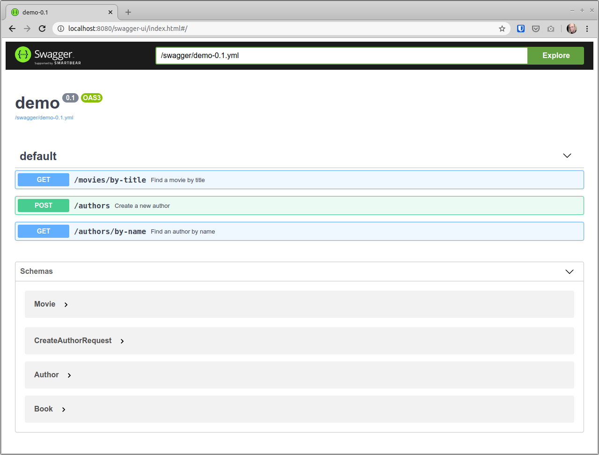

# Micronaut Testing best practices

This is a Micronaut application with examples of everything I explain in my
[Micronaut Testing best practices](https://objectcomputing.com/products/micronaut/resources/micronaut-testing-best-practices)
webinar.

The commits are self-contained and introduce a new feature at a time. It is suggested to review them independently
instead of just checking the `master` branch directly.


## Configuration

You need to install JDK 11 and Docker.

The application uses the OMDB API to show how to Mock 3rd party APIs. To use the real API you need to create an apikey
at http://www.omdbapi.com and set it in [`application.yml`](https://github.com/ilopmar/micronaut-testing-best-practices/blob/master/src/main/resources/application.yml#L25).


## Run the tests and application

### Run the test

To run all the test:

```bash
$ ./gradlew test
```

### Run the application

It is necessary to have a Postgres database for running the application. You can run it using Docker:

```bash
docker run -it --rm -p 5432:5432 -e POSTGRES_PASSWORD=secret -e POSTGRES_DB=micronaut postgres:11.5-alpine
```

Start the application:

```bash
$ ./gradlew run
```

## Endpoints

To create a new author:

```bash
curl -X POST -H 'Content-Type:application/json' -d '{"name":"Stephen King"}' localhost:8080/authors
```

To find and author by name:

```bash
curl -v "localhost:8080/authors/by-name?author=Stephen%20King&username=admin"
```

**NOTE:** The application will create automatically an author with two books if the database is empty. Take a look at
[BootstrapService](https://github.com/ilopmar/micronaut-testing-best-practices/blob/master/src/main/java/com/example/services/BootstrapService.java#L27-L31).

## OpenAPI and Swagger-UI

The application automatically generates an OpenAPI yml file that is exposed at http://localhost:8080/swagger/demo-0.1.yml.

It also includes the Swagger-UI so you can take a look at the API documentation and execute the different methods directly
from the browser: http://localhost:8080/swagger-ui/index.html.



## GraalVM

It is possible to convert the application to a [GraalVM](https://www.graalvm.org/) native-image.

If you don't have GraalVM installed, run:

```bash
$ sdk install java 20.1.0.r11-grl
$ gu install native-image
```

Then, to convert the application to a native-image:

```bash
$ sdk use java 20.1.0.r11-grl
$ ./gradlew assemble
$ native-image --no-server --class-path build/libs/demo-0.1-all.jar
```

And run it:

```bash
$ ./demo
22:47:26.461 [main] INFO  com.zaxxer.hikari.HikariDataSource - HikariPool-1 - Starting...
22:47:26.467 [main] INFO  com.zaxxer.hikari.HikariDataSource - HikariPool-1 - Start completed.
22:47:26.485 [main] INFO  io.micronaut.runtime.Micronaut - Startup completed in 33ms. Server Running: http://localhost:8080
```

